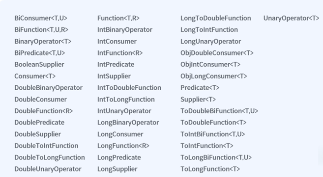

# java-functional-practice

### 1급 시민서에 대해서.

1급 시민은 사전 조건 3가지가 있다.
1. 함수/메서드 의 매개변수 (parameter) 로써 전달 할 수 있는가.
2. 함수/메서드 의 반환값 (return) 이 될 수 있는가.
3. 변수에 담을 수 있는가.

위 조건들을 만족하면 1급 시민 이 된다.
Object 를 생각해 봤을때, 매개변수 받을수 있고, 반환값 있고, 변수에 담을 수 도 있다.
- 그래서 Object 는 1급 시민이다.
- 함수를 생각해 보면, 매개변수로 함수를 지정 할 수도없고, 반활할떄 함수로 지정한다는것,
- 어떤 변수를 선언하고 , 함수를 호출하는것도 아닌, 함수 자체를 지정한다면,
- 그 변수는 무슨타입이고,, 뭔가 싶다.

함수 를 object 형태로 나타낸다면, 이모든게 해결된다. 

---
### Adder 라는 Class 가  필요없이 lamda 로 n + 10

Function<Integer,Integer> myAdder = new Adder();
X : myAdder(1); -> 11
O : Function<Integer, Integer> myAdder = x -> x + 10;

---
### input 2개로 해결한다면 ?
```java
    public static void main(String[] args) {
        BiFunction<Integer, Integer, Integer> add = (x, y) -> x + y;
        int result = add.apply(3,5);
        System.out.println("result = " + result);
    }
```

### 위 까지는 2개의 Input 으로 해결 할 수 있는 방안.

3개는 커스텀 해야된다.

Functional interface ( 함수의 뼈대 )
- 단 하나의 abstract method 만을 가지는 인터페이스
- (Single Abstract Method interface)
- Default method 와 static method 는 이미 구현이 되어있으므로 있어도 괜찮다.
- java.lang.Runnable, java.saction1.util.Comparator, java.saction1.util.concurrent.Callable, etc


마무리
- Functional Interface
  - 단 하나의 abstract method 를 가진 interface
  - Function interface
  - BiFunction Interface
  - 나만의 Functional interface
- Lambda Expression
  - 함수형 인터페이스를 구현하는 가장 간단한 방법

### Functional interface
- 변수에 넣고 뿌려주는 기능 에서 그이외 기능을 구현
- Supplier 인터페이스
  - Supplier 는 공급하는 인터페이스.
  - 함수형 인터페이스는 단, 하나의 abstract method 를 갖는데, 
  - 아무런 input 이 없이 return 값 만 가지는 함수다.
- Consumer 인터페이스
  - Supplier 와 Consumer 는 정 반대다.
  - Consumer 는 input Params 만 받는다, 아무것도 리턴하지 않는다.
- BiConsumer
  - 2개의 input param 을 가지고 accept 를 가지는 아무것도 리턴하지 않는 functional interface
- Predicate
  - 어떠한 인풋을 받아서 Boolean 값을 리턴하는 fn interface 다.
- Comparator
  - input 2 개를 받아서 어떤 것이 앞으로 가야 되는지 비교를 위한 인터페이스

--- 
함수가 다른 메서드의 파라미터로 간다는게 어떤것인지 체킹하는게 포인트.



### 메서드 레퍼런스
Method Reference
- 기존에 이미 선언되어있는 메서드를 지정하고 싶을 때
- 오퍼레이터 사용
- 생략이 많기 때문에 사용할 메서드의 매개변수의 타입과 리턴 타입을 미리 숙지해야함.

Case 4 가지
- ClassName::staticMethodName
  - 클래스의 static method 를 지정할때
- objectName::instanceMethodName
  - 선언 된 객체의 instance method 를 지정할때
- ClassName::instanceMethodName
  - 객체의 instance method 를 지정할때
- ClassName::new 
  - 클래스의 constructor 를 지정할때
  
---

기존에 선언되어 있는 메서드를 지정
- Method Reference
  - ClassName::StaticMethodName
  - objectName::instanceMethodName
  - ClassName::instanceMethodName
- Constructor Reference
  - ClassName::new

---
### Stream
- Stream 은 함수형 인터페이스를 적극 활용해 데이터를 매우 간편하게 가공하게 해주는 도구이다.
- 컬렉션 형태로 구성된 데이터를 람다를 이용해 간결하고 직관적으로 프로세스 하게 해준다고 한다.
- for while 등을 사용하던 기존 loop 를 대체
- 손쉽게 병렬처리를 해줌

- 스트림은 컬렉션 형태의 데이터의 흐름
  - Source
  - Intermediate (중간처리)
  - Terminal Operations (종결처리)
  - 3가지로 구분되어 있고 중간처리는 여러개를 이어붙이는 것이 가능하다.
---
스트림 안에 기능들
- 여러 개의 중간 처리를 연결할 수 있음
  - Filter 스트림 데이터중에서 어떠한 조건을 만족하는 데이터 목록을 불러와주고
  - Map 스트림 안에 데이터에 어떠한 처리를 해서 다른형태로 변형을.
  - Sorted 스트림안의 데이터를 정렬을 시켜주고
  - Distinct 데이터의 중복을 제거해주고
  - FlatMap map 처럼 데이터의 어떠한 처리를 함과 동시에 그 결과를 납작하게 만들어서 stream of stream 이 아니라, 그냥 stream 이 되도록 해준다.